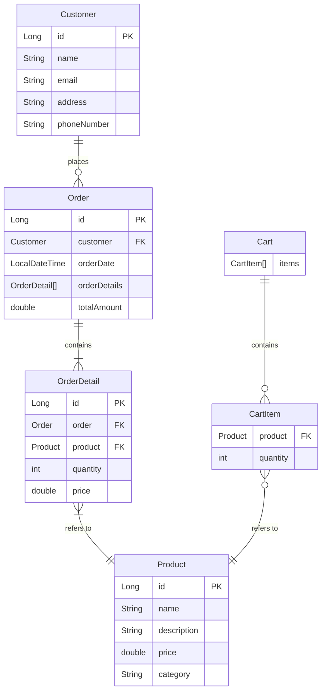

# ER図



## エンティティ説明

| エンティティ | パッケージ | 説明 |
|---|---|---|
| `Customer` | `entity` | 顧客情報（JPA エンティティ） |
| `Product` | `entity` | 商品情報（JPA エンティティ） |
| `Order` | `entity` | 注文情報（JPA エンティティ、テーブル名: `orders`） |
| `OrderDetail` | `entity` | 注文明細（JPA エンティティ） |
| `Cart` | `model` | セッションスコープのカート（Spring Bean、非永続） |
| `CartItem` | `model` | カート内の商品アイテム（POJO、非永続） |

## リレーションシップ

| 関係 | 種別 | 説明 |
|---|---|---|
| `Customer` → `Order` | 1対多 | 1人の顧客が複数の注文を持つ |
| `Order` → `OrderDetail` | 1対多（cascade ALL） | 1つの注文が複数の注文明細を持つ |
| `OrderDetail` → `Product` | 多対1 | 注文明細は1つの商品を参照する |
| `Cart` → `CartItem` | 1対多 | 1つのカートが複数のカートアイテムを持つ |
| `CartItem` → `Product` | 多対1 | カートアイテムは1つの商品を参照する |
```
